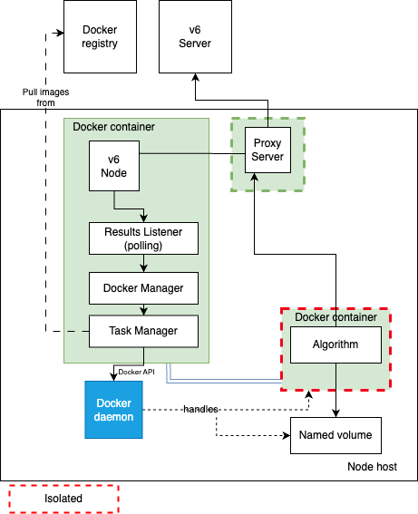
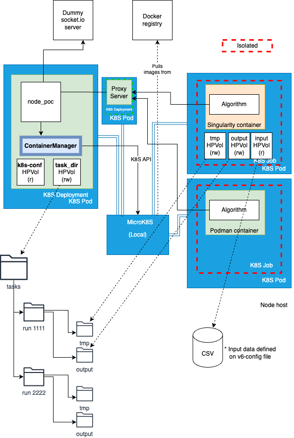
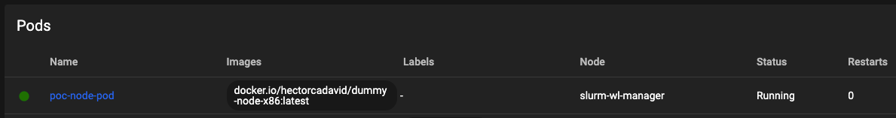
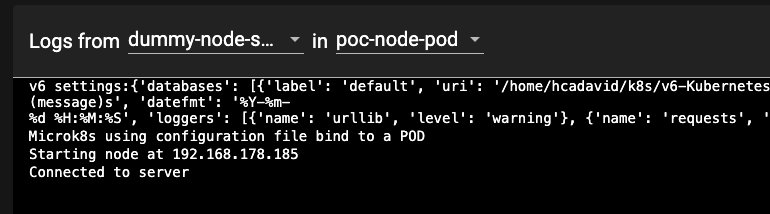
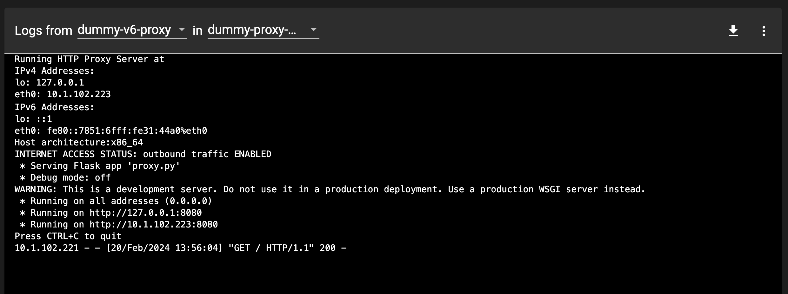
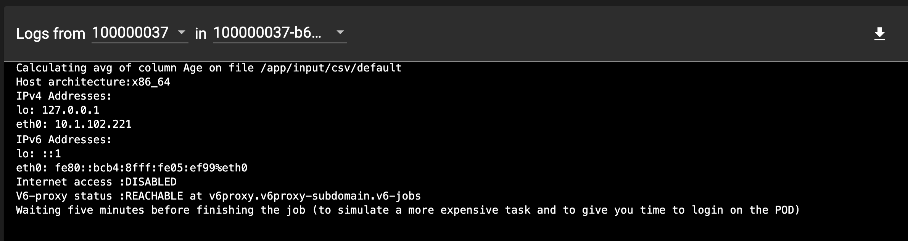

# vantage6 on Kubernetes proof of concept

This repository contains a proof of concept for refactoring the Node component of Vantage6, particularly focusing on how it handles containerized algorithms.

## About vantage6 and containers management

[vantage6](https://distributedlearning.ai/) is a federated learning platform designed to facilitate privacy-preserving analysis without sharing sensitive data. The current architecture involves a central server, nodes, and clients. Nodes are responsible for executing algorithms on local data and securely communicating the results back to the server.

Vantage6 Nodes currently depend on the Docker API for container management (i.e., pulling images, creating the containers, linking I/O data to the containerized algorithms, checking its status, etc), as illustrated in the diagram below.




While Docker provides a robust environment for executing algorithms, [discussions within the community](https://github.com/bdh-generalization/requirements/issues/7) are calling for enabling support for alternative containerization technologies. 

The motivations for this include:

- In many cases, the computing infrastructure within many health institutions has these alternatives installed by default, with podman and singularity as prominent examples.
- These alternative containerization technologies follow an architectural approach that offers more security: they do not require a long-running daemon process with root privileges like Docker. They are, by design, rootless.
- The algorithm containerization should not be constrained to a single technology. Ideally, vantage6 should support multiple container formats and runtimes.

Based on the discussion on [the potential alternatives](https://github.com/bdh-generalization/requirements/issues/7#issuecomment-1852243535) for this, this project is aimed at exploring a transition from a Docker-API to a Kubernetes-centered one. This alternative architecture, which could be deployed either on an existing Kubernetes cluster, or on a local lightweight (yet production ready) Kubernetes server (e.g., [microk8s](https://microk8s.io/) and [k3s](https://k3s.io/)) would have as additional benefits:

- A Kubernetes-API centered architecture on the Node would allow -in principle- to run algorithms containerized with any CRI-complaint, and to co-exist within the same isolated network.
- A significant part of the container management complexity could be separated from the application (e.g., algorithms isolation, I/O volume mount permissions, 'self-healing', etc).
- The overall management and diagnostics process at runtime would be simplified by enabling the use of Kubernetes tools (e.g., [Dashboards](https://kubernetes.io/docs/tasks/access-application-cluster/web-ui-dashboard/))


## Proof of concept

vantage6 is a piece of software too complex to perform experiments on its core architecture. Therefore, exploring the feasibility of doing this major architectural change, and validating our current assumptions about it, requires a prototyped solution as a proof of concept.

This prototype reimplements the methods of vantage6's DockerManager class (on a new class called ContainerManager) using the Kubernetes API. Furthermore, it is based on the settings given by the current [vantage6 configuration file format](https://docs.vantage6.ai/en/main/node/configure.html) (the settings still not considered are under comments).

The other artifacts in this repository are below described:

- dummy-socketio-server: 
	- simple-sio-server: a minimalist (dummy) vantage6 server -just to publish the tasks the Node must perform.
	- command-emitter: script for publishing task descriptions in JSON format to the server (which are then collected and executed by the Node).


- node-poc: 
	- container_manager.py: the re-implementation of the methods of the original DockerManager, using the Kubernetes API.
	- node.py: a process that listens for requests published on the 'dummy server', and executes ContainerManager methods accordingly.
	
- avg_alg: 'dummy' algorithm using the I/O conventions used by the PoC.
  	

## Proof of concept status

- [x] Baseline code for experiments
- [x] Programmatically launching algorithms as job PODs, binding volumes to them, according to v6 configuration settings: ('task_dir': output, tmp, token) and ('databases': input). * See diagram below.
- [x] Kubernetes configuration for launching the node as a POD deployment, giving it access to the host's Kubernetes configuration (so it can perform further operations on Kubernetes programmatically).
- [X] Defining network isolation rules for the POD jobs as a NetworkPolicy resource. Create 'diagnostics' algorithms to check these rules.
- [X] Include the Proxy server, and add isolation rules accordingly.
- [ ] Task-status related methods (getting results, listing, killing tasks, etc).
- [ ] Communication between algorithms and the server through the Proxy.
- [ ] Evaluation of GPU resources pass-through & combining image types (podman, singularity)
- [ ] Node-to-node communication through a VPN
- [ ] Launching the node as a POD deployment programatically (so settings from v6 configuration file are used)
- [ ] Setup for K3S (for linux distros that do not support snap)
- [ ] Setup for actual Kubernetes clusters (e.g., switching from HP-binds to Persistenv Volumes and volume-claims)




## Setup (using microk8s)


1. Setup microk8s on [Linux](https://ubuntu.com/tutorials/install-a-local-kubernetes-with-microk8s#1-overview). It can be installed on [Windows](https://microk8s.io/docs/install-windows), but this PoC has been tested only on Ubuntu environments.

2. Setup and enable the Kubernetes dashboard [following the microk8s guidelines](https://microk8s.io/docs/addon-dashboard). 

3. Clone the repository.

4. Edit the v6-node configuration file (node_poc/node_config.yaml), and update the path of the csv included in the repository, as the 'default' database.

	```
	databases:
	  - label: default
	    uri: /<path>/v6-Kubernetes-PoC/csv/employees.csv
	    type: csv
	```

5. In the same configuration file, set the 'task_dir' setting (directory where local task files are stored). Just add the path of an empty folder (Kubernetes will take care of creating the subfolders when needed!)

	```
	task_dir: /<ouput_path>/tasks
	```


6. Edit the 'dummy' server configuration file (dummy_socketio_server/server_config.yaml), and set the local IP address of the network adapter you want the server to be listening on. The Node, when running within a POD, will reach this port on the given IP, so a local IP address different than localhost/127.0.0.1. is needed.

	```
	# IP address of the adapter where the server will be listening to
	server_ip: 192.168.178.185
	
	# port
	port: 5000
	```


7. Open a terminal and create a Python virtual environment, with the needed dependencies:

	```
	python -m venv venv
	source venv/bin/activate
	pip install -r requirements.txt
	```

8. Run the 'dummy-server':

	```
	cd dummy_socketio_server
	python simple_sio_server.py
	```

9. You will now launch the Node as a Deployment POD through the kubectl command (in future iterations this would be done programatically). For this, you first need to update some volume-binding settings of the Node/POD configuration file (`node_poc/node_poc_config.yaml`) so it is consistent with the vantage6 'task-dir' setting. The POD configuration also requires to define the location of the Kubernetes and vantage6 configuration file. If the steps for setting up microK8S where followed, this configuration file is located at $HOME/.kube/config.


	```
	volumes:
	 - name: task-files-root
	   hostPath:
	     path: 	/<ouput_path>/tasks
	 - name: kube-config-file
	   hostPath:
	     path: /home/myhome/.kube/config   
	 - name: v6-node-config-file
	   hostPath:
	     path: /home/myhome/<clone_path>/v6-Kubernetes-PoC/node_poc/node_config.yaml
	```

10. __(Optional)__ Please note that you will be deploy -as a POD- a containerized copy of the Node already published on Dockerhub (docker.io/hectorcadavid/dummy_v6_node:latest). Once you have made changes to the Node source code, you will need to publish the new version on your own local or online registry, and update the spec/containers/image value accordingly on node_poc/kubeconfs/node_pod_config.yaml:

	```
	spec:
	 containers:
	 - name: dummy-node-server
	   image: docker.io/hectorcadavid/dummy_v6_node:latest
	```


11. Start the microk8s/Kubernetes dashboard on a separate terminal (you will need to copy the login token again everytime the session expires).

	```
	microk8s dashboard-proxy
	```
12. Open the dashboard running on the 10443 port (https://localhost:10443/). 


13. __(Update)__ Execute the v6-node related kubernetes configuration located on node_poc/kubeconfs: one for [deploying the Node](node_poc/kubeconfs/node_pod_config.yaml) (previously mentioned) and another for [applying Network Policies](node_poc/kubeconfs/network_policies.yaml). To apply both configurations at once just give the 'kubeconfs' folder as argument to the kubectl command:

	```
	cd node_poc
	kubectl apply -f ./kubeconfs
	```

	Once you have done this, check in the dashboard the status of the POD and the log messages to make sure it is working correctly.
	
	
	


14. __(New)__ In order to test the network policies, you also need to deploy a 'dummy-proxy'. This proxy is expected to be the only endpoint any algorithm has access to when a request to the v6-server is needed. 

	```
	cd dummy_proxy
	kubectl apply -f proxy_pod_deployment.yaml
	```

	Check the proxy's POD boot logs, and make sure that they report the outbound traffic as enabled:

	


15. __(Updated)__ Now, you can publish requests to the server, to activate a task on the Node. You can edit the sample script on `dummy_socketio_server`/`command_emitter.py`. Update the IP address and port so it matches the ones on your 'dummy' server, and define a 'payload' with a different run_id each time. 

	The given example launches an 'avg' algorithm published on Dockerhub (hectorcadavid/v6_average_algorithm). This algorithm depends on provisional file system conventions of the PoC: (1) all csv-DBs given on the v6 configuration file will be bound as a file on the /app/input/csv within the container, and (2) the output folder of the given 'run' will be bound to the 'app/output' folder within the container. The latter, as described in the diagram, will correspond to the directory hierarchy on the host: `<task-dir-setting-path`>/`<run_id`>/`output`.

 
	```
	sio = socketio.Client()
	sio.connect('http://192.168.178.185:5000')
	
	
	run_cmd_payload = {
	    "run_id": 33333312,
	    "task_info": {"arg1":"/app/input/csv/default","arg2":"Age","arg3":"/app/output/avg.txt"},
	    "image": "hectorcadavid/v6_average_algorithm",
	    "docker_input": "input1",
	    "tmp_vol_name": "example-tmp-vol",
	    "token": "example_token",
	    "databases_to_use": ["default","db1", "db2", "db3"]
	    }
	
	sio.emit('command_request',run_cmd_payload)
	time.sleep(1)
	sio.disconnect()
	
	``` 

16. __(Updated)__ Once the request to execute the avg-algorithm has been posted and the Node processed it, you can check the status with the Kubernetes dashboard. As [this algorithm](avg_alg/app.py) now also checks (1) whether the Internet is reachable from where it is executed, and (2) whether the 'proxy' is reachable using kubernetes' internal DNS, make sure that the logs report that:
	- Outbound access is disabled
	- The proxy is reachable

	

	As the 'algorithm' will be running for five minutes, you can also open a terminal through the dashboard on the corresponding POD, and perform further experiments (e.g., run wget commands).


17. Now you can check the directories structure and output files created by the Node and by the algorithms on the host. For example:

	```
	tree /<task-dir-setting-path>
	```
