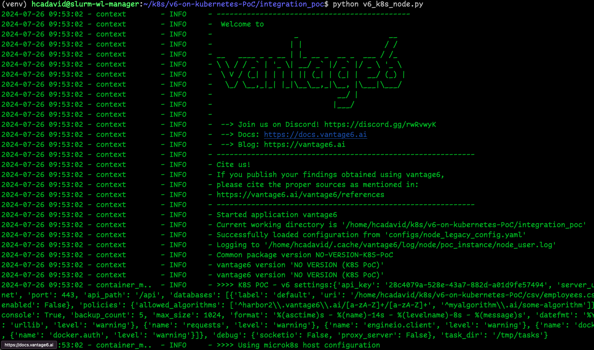
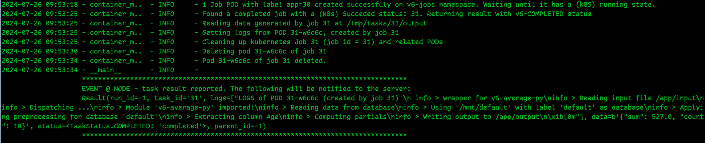
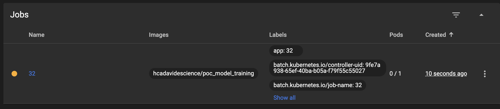
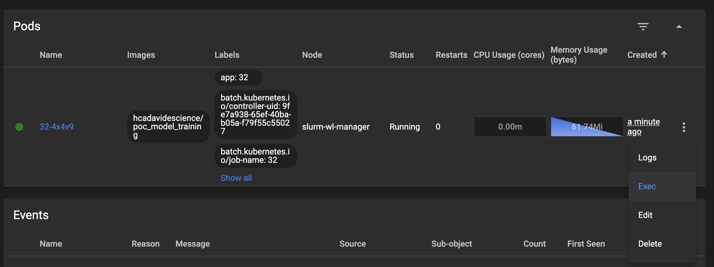
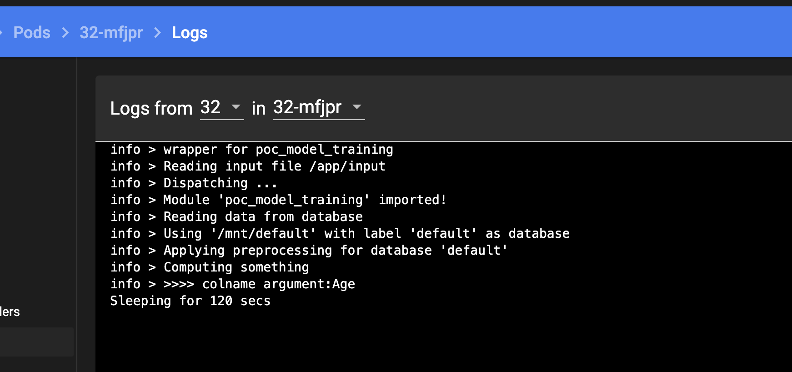
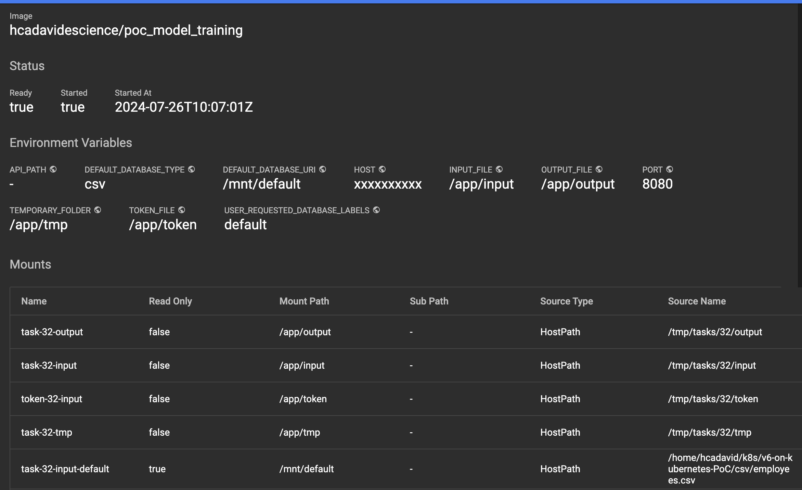

## Integration proof of concept

The codebase on the `integration_poc` folder is an implementation of a V6 node intended to work as a regular (Docker-based) V6 node, but working with a K8S cluster under the hood. It is based on the `node_poc`. The 

- v6_k8s_node.py:
	- The application that launches the node. It can be launched from the host for testing purposes, but it is intended to be running within a POD.
- container_manager.py:
	- The refactored version of DockerManager (and other clases used by it) using the K8S API.
- vantage6:
	- This folder contains the minimum set of original vantage6-node modules needed for the node to work (e.g., data-transfer classes, data exchange utilities, etc). These belong to version 4.5.5 of vantage6.
	

## Status

- [x] Integrating the minimun number of V6 core dependencies for reimplementing a node 
- [x] Authentication against the server, Socket.io connection
- [x] Creating I/O and token files, binding them to the POD, setting the ENV variables required by the algorithm
- [x] Launching a V6-algorithm (tested through the kubernetes dashboard)
- [X] Listen for task finalization (implemented onthe PoC, adaptation is required)
- [ ] Reporting the results back to the server properly
- [ ] Encrypted data exchange
- [ ] Launch the (actual) node proxy as a POD, apply the networking policies as it was done on the PoC
- [ ] Enabling the proxy for the algorithms to reach the server.
- [ ] Handling multiple K8S status (see reported issues)
- [ ] + Other features yet to be explored through the architectural proof of concept


## Setup (using microk8s) 

1. Setup a vantage6 server (use version 4.5.5), create an organization for the K8S-V6-node, and a collaboration that includes it. Copy the JSON Web Token, as it will be used later.

2. Setup microk8s on [Linux](https://ubuntu.com/tutorials/install-a-local-kubernetes-with-microk8s#1-overview). It can be installed on [Windows](https://microk8s.io/docs/install-windows), but this PoC has been tested only on Ubuntu environments.

3. Setup and enable the Kubernetes dashboard [following the microk8s guidelines](https://microk8s.io/docs/addon-dashboard). 

4. Clone the repository. Work on the `integration_poc` folder.

5. Edit the v6-node configuration file (integration_poc/configs/node_legacy_config.yaml), and update the path of the csv included in the repository, as the 'default' database.

	```
	databases:
	  - label: default
	    uri: /<path>/v6-Kubernetes-PoC/csv/employees.csv
	    type: csv
	```

6. In the configuration file, add the connection settings of your V6 server:

	```
	# API key used to authenticate at the server.
	api_key: 

	# URL of the vantage6 server
	server_url: 

	# port the server listens to
	port: 

	# API path prefix that the server uses. Usually '/api' or an empty string
	api_path: 

	```


6. In the onfiguration file, set the 'task_dir' setting (directory where local task files are stored). Just add the path of an empty folder (Kubernetes will take care of creating the subfolders when needed!)

	```
	task_dir: /<ouput_path>/tasks
	```


7. Open a terminal on the `integration_poc` folder and create a Python virtual environment, with the needed dependencies:

	```
	python -m venv venv
	source venv/bin/activate
	pip install -r requirements.txt
	```

8. Start the node from the host. Please keep in mind that the node is expected to be launched within a service POD (so that the network policies can be applied to it), so this step will be eventually updated (once this configuration has been properly tested).

	```
	python v6_k8s_node.py
	```

	If your server configuration is correct, you should get a launch screen similar to the one of the origial V6-node:

	


9. Open the Kubernetes dashboard (select the 'v6-jobs' namespace) to explore what is happening under the hood in the following steps.

10. Request the execution of the **partial** part of a V6 algorithm. A 'central' function wouldn't work yet as the networking for the communication between algorithms and the proxy is yet to be done. You can do this using the web-based user interface, or the python client. On the node logs you will see how after this execution request is received, a new Job POD is created:

	

	Check the Jobs list on the K8S dashboard. The ID of the Job should match the ID of the Task on the V6 server. Please note that once the job is finished, the PODs created for it are destroyed, so you may not be able to check the following details if the job has a short runtime. The following screenshots are from a function that 'sleeps' for two minutes before returning the results:

	

	When checking the Job, you will see the related POD that is running the container. These will have the same name, plus a random string. From here, you can see the execution Logs and even open a shell terminal (Exec) on the container.

	

	

	The POD view provide further details on the container's mounted volumes and environment variables.

	
