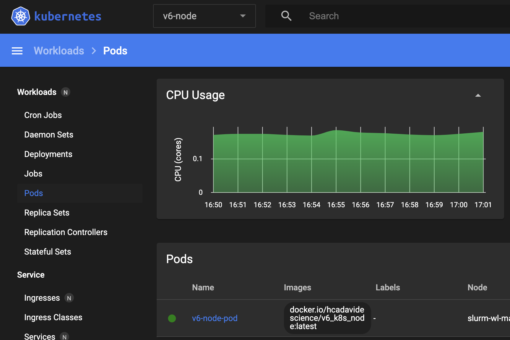
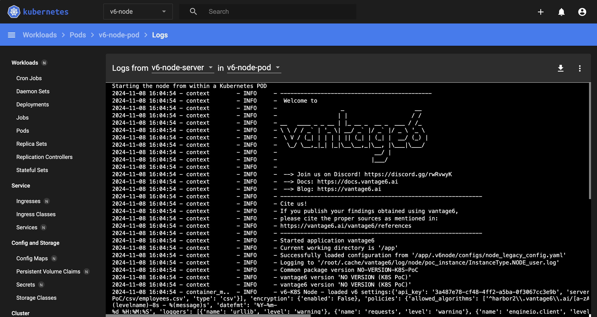

## Integration proof of concept

The codebase on the `integration_poc` folder is an implementation of a V6 node intended to work as a regular (Docker-based) V6 node, but working with a K8S cluster under the hood. It is based on the `node_poc`. The 

- v6_k8s_node.py:
	- The application that launches the node. It can be launched from the host for testing purposes, but it is intended to be running within a POD.
- container_manager.py:
	- The refactored version of DockerManager (and other clases used by it) using the K8S API.
- vantage6:
	- This folder contains the minimum set of original vantage6-node modules needed for the node to work (e.g., data-transfer classes, data exchange utilities, etc). These belong to version 4.5.5 of vantage6.
	

## Status

- [x] Integrating the minimun number of V6 core dependencies for reimplementing a node 
- [x] Authentication against the server, Socket.io connection
- [x] Creating I/O and token files, binding them to the POD, setting the ENV variables required by the algorithm
- [x] Launching a V6-algorithm (tested through the kubernetes dashboard)
- [X] Listening for task finalization (implemented onthe PoC, adaptation is required)
- [X] Launching the node and the proxy as a POD
- [X] Reporting the results back to the server properly 
- [ ] Applying the networking policies as it was done on the PoC, enabling the proxy for the algorithms to reach the server.
- [ ] Encrypted data exchange
- [ ] Handling multiple K8S status (see reported issues)
- [ ] + Other features yet to be explored through the architectural proof of concept


## Launching the node and linking it to a V6 server (using microk8s) 

1. Setup a vantage6 server (tested with version 4.7.0), create an organization for the K8S-V6-node, and a collaboration that includes it. Copy the JSON Web Token, as it will be used later.

2. Setup microk8s on [Linux](https://ubuntu.com/tutorials/install-a-local-kubernetes-with-microk8s#1-overview). It can be installed on [Windows](https://microk8s.io/docs/install-windows), but this PoC has been tested only on Ubuntu environments.

3. Setup and enable the Kubernetes dashboard [following the microk8s guidelines](https://microk8s.io/docs/addon-dashboard). 

4. Clone the repository. Work on the `integration_poc` folder.

5. Build the docker image and publish it on a Docker registry. You can edit and use the script `build_and_publish.sh` to build an image compatible with both ARM and x86 architectures.

6. Edit the v6-node configuration file (integration_poc/configs/node_legacy_config.yaml), and update the path of the csv included in the repository (or any other CVS you want to use), as the 'default' database.

	```
	databases:
	  - label: default
	    uri: /<path>/v6-Kubernetes-PoC/csv/employees.csv
	    type: csv
	```

7. In the configuration file, add the connection settings of your V6 server:

	```
	# API key used to authenticate at the server.
	api_key: 

	# URL of the vantage6 server
	server_url: 

	# port the server listens to
	port: 

	# API path prefix that the server uses. Usually '/api' or an empty string
	api_path: 

	```

8. In the onfiguration file, set the 'task_dir' setting (directory where local task files are stored). 

	```
	task_dir: /<ouput_path>/tasks
	```

9. Create the tasks folder on tha path previously configured. If you don't do this, Kubernets will create it with root as the owner, which will cause problems as the JOB PODs don't have root privileges for creating sub-folders on it.

10. Edit the Kubernetes YAML configuration file used for launching the Node as a POD:

	- Add the reference to the image (e.g., in Dockerhub) created in Step #5.

	```YAML
	containers:
	- name: v6-node-server
	image: DOCKER_IMAGE_GENERATED_IN_PREVIOUS_STEPS
	tty: true
	env:
	```

	- Add the full URI of the default database defined in step #6. In the `mountPath`, include the prefix `/app/.databases/`, and on the `hostPath`add the URI as-is:

	```YAML
    - name: v6-node-default-database
      mountPath: /app/.databases/{ABSOLUTE_HOST_PATH_OF_DEFAULT_DATABASE}

	...

	- name: v6-node-default-database
	  hostPath:
	    path: ABSOLUTE_HOST_PATH_OF_DEFAULT_DATABASE

	```

	- Add the abosolute path of the task folder, as defined in the v6-node configuration file (step #8).
	```YAML
	volumes:
	- name: task-files-root
	  hostPath:
	    path: ABSOLUTE_HOST_PATH_OF_THE_TASK_FOLDER
	```

	- Add the absolute path of the kubernetes configuration file. This integration PoC has been tested with Ubuntu server 22.04 and MicroK8S, where such configuration file is by default on `/home/<user_name>/.kube/config`.

	```YAML
	- name: kube-config-file
	  hostPath:
	    path: ABSOLUTE_HOST_PATH_OF_THE_KUBE_CONFIG_FOLDER
	```

	- Add the absolute path of the vantage6 configuration file (the one edited on Step #6):	
	```YAML
	- name: v6-node-config-file
	  hostPath:
	    path: ABSOLUTE_HOST_PATH_OF_THE_VANTAGE6_NODE_CONFIG_FILE

    ```

11. Launch the Node with the `kubectl` command:

	```
	bash:~/$ kubectl apply -f kubeconfs/node_pod_config.yaml

	```

12. Open the Kubernetes dashboard, select the 'v6-node' namespace, and check that the `v6-node-pod` POD is now running.




13. Open tbe `v6-node-pod` logs on the dashboard and check that the node startup sequence is completed with no problems.




14. Request the execution of a V6 algorithm on the vantage6 server. You can do this using the web-based user interface, or the python client. Reload the logs from Step #13 to verify how after this execution request is received, a new Job POD is created:

	

	Check the Jobs list on the K8S dashboard. The ID of the Job should match the ID of the Task on the V6 server. Please note that once the job is finished, the PODs created for it are destroyed, so you may not be able to check the following details if the job has a short runtime. The following screenshots are from a function that 'sleeps' for two minutes before returning the results:

	

	When checking the Job, you will see the related POD that is running the container. These will have the same name, plus a random string. From here, you can see the execution Logs and even open a shell terminal (Exec) on the container.

	

	

	The POD view provide further details on the container's mounted volumes and environment variables.

	


