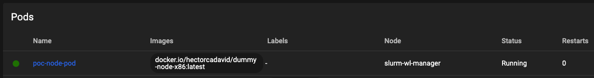
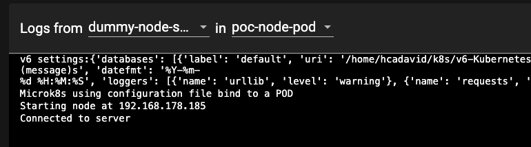
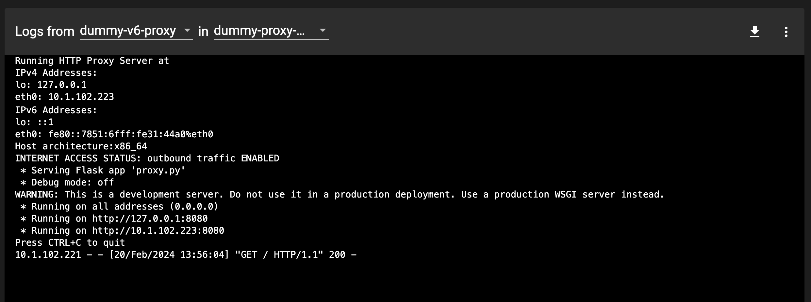
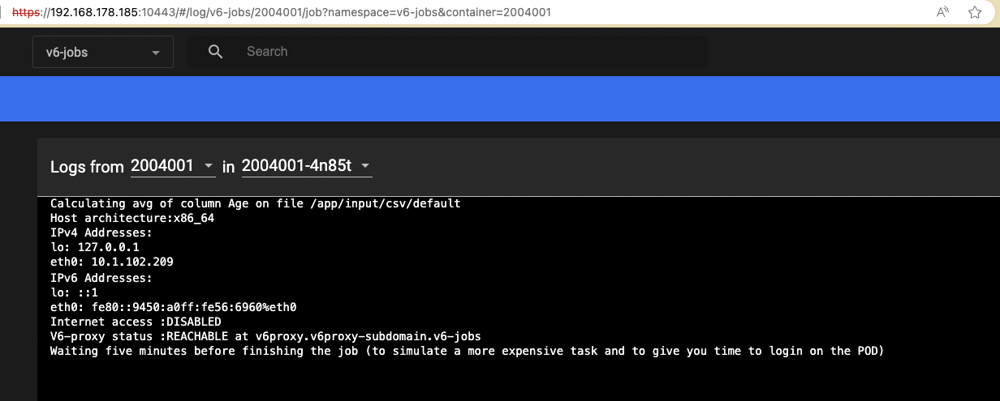
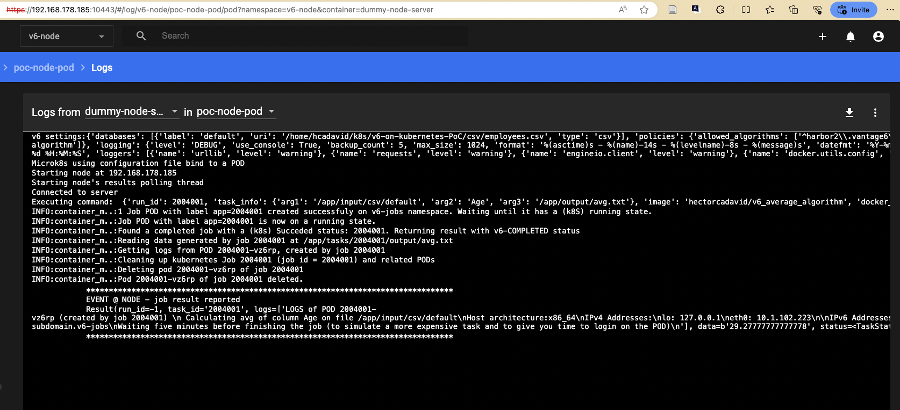

## Architectural proof of concept

The codebase on the `node_poc` folder is an implementation of a simplified version of the vantage6 client/server architecture. It is intended to be used to perform experiments for making design decisions (being the integration with K8S the most important one) without dealing with the complex V6 codebase. It consist of:

- A dummy server (`dummy-socketio-server`): 
	- simple-sio-server: a minimalist (dummy) vantage6 server -just to publish the tasks the Node must perform.
	- command-emitter: script for publishing task descriptions in JSON format to the server (which are then collected and executed by the Node).

- A dummy algorithm (`avg_alg`): 
	- 'dummy' algorithm using the I/O conventions used by the PoC.

- A dummy proxy server (`dummy_socketio_server`): 
	- Proxy HTTP server - a mock of the proxy used by the V6 node (and the running algorithms) to talk with the V6 server. It is intended only for testing networking rules configurations.

- An implementation of a V6-node that works with a refactored V6's DockerManager class, which works with K8S instead of the Docker daemon (`node-poc`). It includes:
	- container_manager.py: the re-implementation of the methods of the original DockerManager, using the Kubernetes API.
	- node.py: a process that listens for requests published on the 'dummy server', and executes ContainerManager methods accordingly.
	
	

## Status

- [x] Baseline code for experiments
- [x] Programmatically launching algorithms as job PODs, binding volumes to them, according to v6 configuration settings: ('task_dir': output, tmp, token) and ('databases': input). * See diagram below.
- [x] Kubernetes configuration for launching the node as a POD deployment, giving it access to the host's Kubernetes configuration (so it can perform further operations on Kubernetes programmatically).
- [X] Defining network isolation rules for the POD jobs as a NetworkPolicy resource. Create 'diagnostics' algorithms to check these rules.
- [X] Include the Proxy server, and add isolation rules accordingly.
- [X] Algorithm/job execution control: the node polls the status of the running algorithms, capture the status of the completed ones (successful or failed), and destroy the jobs and pods when no longer needed.
- [ ] Evaluation of GPU resources pass-through & combining image types (podman, singularity)
- [ ] Node-to-node communication using multi-cluster networks
- [ ] Launching the node as a POD deployment programatically (so settings from v6 configuration file are used)
- [ ] Setup for K3S (for linux distros that do not support snap)
- [ ] Setup for actual Kubernetes clusters (e.g., switching from HP-binds to Persistenv Volumes and volume-claims)


## Setup (using microk8s)


1. Setup microk8s on [Linux](https://ubuntu.com/tutorials/install-a-local-kubernetes-with-microk8s#1-overview). It can be installed on [Windows](https://microk8s.io/docs/install-windows), but this PoC has been tested only on Ubuntu environments.

2. Setup and enable the Kubernetes dashboard [following the microk8s guidelines](https://microk8s.io/docs/addon-dashboard). 

3. Clone the repository.

4. Edit the v6-node configuration file (node_poc/node_config.yaml), and update the path of the csv included in the repository, as the 'default' database.

	```
	databases:
	  - label: default
	    uri: /<path>/v6-Kubernetes-PoC/csv/employees.csv
	    type: csv
	```

5. In the same configuration file, set the 'task_dir' setting (directory where local task files are stored). Just add the path of an empty folder (Kubernetes will take care of creating the subfolders when needed!)

	```
	task_dir: /<ouput_path>/tasks
	```


6. Edit the 'dummy' server configuration file (dummy_socketio_server/server_config.yaml), and set the local IP address of the network adapter you want the server to be listening on. The Node, when running within a POD, will reach this port on the given IP, so a local IP address different than localhost/127.0.0.1. is needed.

	```
	# IP address of the adapter where the server will be listening to
	server_ip: 192.168.178.185
	
	# port
	port: 5000
	```


7. Open a terminal and create a Python virtual environment, with the needed dependencies:

	```
	python -m venv venv
	source venv/bin/activate
	pip install -r requirements.txt
	```

8. Run the 'dummy-server':

	```
	cd dummy_socketio_server
	python simple_sio_server.py
	```

9. You will now launch the Node as a Deployment POD through the kubectl command (in future iterations this would be done programatically). For this, you first need to update some volume-binding settings of the Node/POD configuration file (`node_poc/node_poc_config.yaml`) so it is consistent with the vantage6 'task-dir' setting. The POD configuration also requires to define the location of the Kubernetes and vantage6 configuration file. If the steps for setting up microK8S where followed, this configuration file is located at $HOME/.kube/config.


	```
	volumes:
	 - name: task-files-root
	   hostPath:
	     path: 	/<ouput_path>/tasks
	 - name: kube-config-file
	   hostPath:
	     path: /home/myhome/.kube/config   
	 - name: v6-node-config-file
	   hostPath:
	     path: /home/myhome/<clone_path>/v6-Kubernetes-PoC/node_poc/node_config.yaml
	```

10. __(Optional)__ Please note that you will be deploy -as a POD- a containerized copy of the Node already published on Dockerhub (docker.io/hectorcadavid/dummy_v6_node:latest). Once you have made changes to the Node source code, you will need to publish the new version on your own local or online registry, and update the spec/containers/image value accordingly on node_poc/kubeconfs/node_pod_config.yaml:

	```
	spec:
	 containers:
	 - name: dummy-node-server
	   image: docker.io/hectorcadavid/dummy_v6_node:latest
	```


11. Start the microk8s/Kubernetes dashboard on a separate terminal (you will need to copy the login token again everytime the session expires).

	```
	microk8s dashboard-proxy
	```
12. Open the dashboard running on the 10443 port (https://localhost:10443/). 


13. __(Update)__ Execute the v6-node related kubernetes configuration located on node_poc/kubeconfs: one for [deploying the Node](node_poc/kubeconfs/node_pod_config.yaml) (previously mentioned) and another for [applying Network Policies](node_poc/kubeconfs/network_policies.yaml). To apply both configurations at once just give the 'kubeconfs' folder as argument to the kubectl command:

	```
	cd node_poc
	kubectl apply -f ./kubeconfs
	```

	Once you have done this, check in the dashboard the status of the POD and the log messages to make sure it is working correctly.
	
	
	


14. __(New)__ In order to test the network policies, you also need to deploy a 'dummy-proxy'. This proxy is expected to be the only endpoint any algorithm has access to when a request to the v6-server is needed. 

	```
	cd dummy_proxy
	kubectl apply -f proxy_pod_deployment.yaml
	```

	Check the proxy's POD boot logs, and make sure that they report the outbound traffic as enabled:

	


15. __(Updated)__ Now, you can publish requests to the server, to activate a task on the Node. You can edit the sample script on `dummy_socketio_server`/`command_emitter.py`. Update the IP address and port so it matches the ones on your 'dummy' server, and define a 'payload' with a different run_id each time. 

	The given example launches an 'avg' algorithm published on Dockerhub (hectorcadavid/v6_average_algorithm). This algorithm depends on provisional file system conventions of the PoC: (1) all csv-DBs given on the v6 configuration file will be bound as a file on the /app/input/csv within the container, and (2) the output folder of the given 'run' will be bound to the 'app/output' folder within the container. The latter, as described in the diagram, will correspond to the directory hierarchy on the host: `<task-dir-setting-path`>/`<run_id`>/`output`.

 
	```
	sio = socketio.Client()
	sio.connect('http://192.168.178.185:5000')
	
	
	run_cmd_payload = {
	    "run_id": 33333312,
	    "task_info": {"arg1":"/app/input/csv/default","arg2":"Age","arg3":"/app/output/avg.txt"},
	    "image": "hectorcadavid/v6_average_algorithm",
	    "docker_input": "input1",
	    "tmp_vol_name": "example-tmp-vol",
	    "token": "example_token",
	    "databases_to_use": ["default","db1", "db2", "db3"]
	    }
	
	sio.emit('command_request',run_cmd_payload)
	time.sleep(1)
	sio.disconnect()
	
	``` 

16. __(Updated)__ Once the request to execute the avg-algorithm has been posted and the Node processed it, you can check the correspondong job status with the Kubernetes dashboard (select the 'v6-jobs' namespace to find it). As [this algorithm](avg_alg/app.py) now also checks (1) whether the Internet is reachable from where it is executed, and (2) whether the 'proxy' is reachable using kubernetes' internal DNS, make sure that the logs report that:
	- Outbound access is disabled
	- The proxy is reachable

	

	As the 'algorithm' will be running for five minutes, you can also open a terminal through the dashboard on the corresponding POD, and perform further experiments (e.g., run wget commands).


17. __(Updated)__ The poc-node (like the original v6's node) constantly polls for running algorithms (i.e., the k8s jobs within the v6-jobs namespace) that have been completed (either due a successfull execution, or a failed one). When one is found, it gets the output data/results created by it on the filesystem (if the execution was successful), and create a description of the results including this and the execution status. The POC uses the original v6's [Result class](https://github.com/vantage6/vantage6/blob/b4f9676f99d5383a44780689a7dd60c67a73bb85/vantage6-node/vantage6/node/docker/docker_manager.py#L46), and [TaskStatus enumeration](https://github.com/vantage6/vantage6/blob/b4f9676f99d5383a44780689a7dd60c67a73bb85/vantage6-common/vantage6/common/task_status.py#L4)) for this. Upon completion, the poc-node also destroy the job and all the related PODs that were created while trying to complete it (a k8s job will create and lauch a new POD everytime the target task fails, depending on the backoffLimit parameter given during the job dispatch). In this PoC implementation of the node, these execution results are simply shown on the Node's STDOUT, hence you can check these through the Kubernetes dashboard (see the logs of the dummy-proxy-pod POD on the v6-node' namespace).



18. At this point, you can also check how the directory structures and output files are created by the Node and by the algorithms on the host. For example, if the 'task_dir' setting on the v6 configuration file is set to '/tmp/tasks', you can see it with:

	```
	tree /tmp/tasks
	```


